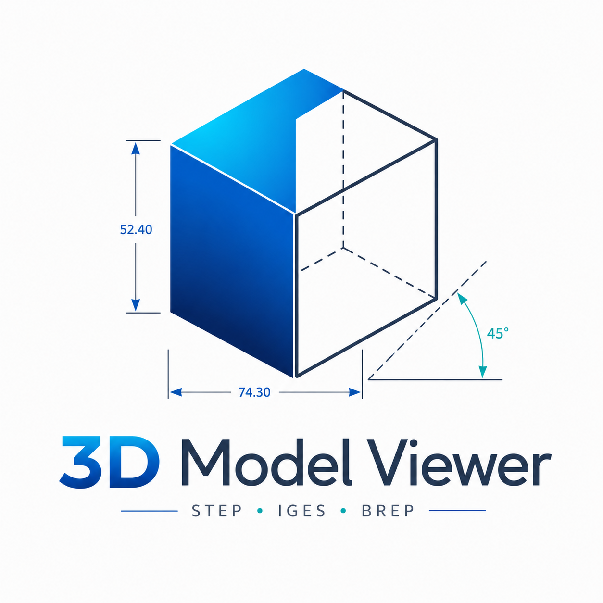

# 3D Model Viewer

A lightweight desktop CAD viewer built with [pythonOCC](https://github.com/tpaviot/pythonocc-core) and PyQt5. Supports STEP, IGES, and BRep files.



## Features

- **File formats** — STEP (`.stp`/`.step`), IGES (`.igs`/`.iges`), BRep (`.brep`); drag-and-drop supported
- **Assembly tree** — check/uncheck parts to toggle visibility; right-click for Isolate, Hide, or Show All
- **Tree ↔ viewport sync** — clicking a part in the 3D view highlights it in the tree, and vice versa
- **Measurement tools**
  - Point-to-point distance (with on-screen annotation, draggable via Shift+drag)
  - 3-point angle
  - Edge length / arc radius; face area
- **Section view** — axis-aligned clip plane with a position slider (View → Section View Panel)
- **Display modes** — Shaded, Shaded with Edges, Wireframe
- **Standard views** — Top, Front, Right, Isometric
- **Dark mode** — Fusion palette + Windows immersive dark title bar
- **Units** — mm, cm, m, in (affects all measurement readouts and Model Info panel)
- **Relative mesh deflection** — mesh quality automatically scales with model size (no coarse blobs on tiny parts, no enormous meshes on large assemblies)

## Requirements

- Python 3.9+
- [pythonocc-core](https://github.com/tpaviot/pythonocc-core) ≥ 7.7
- PyQt5 ≥ 5.15

The easiest way to get `pythonocc-core` is via conda:

```bash
conda install -c conda-forge pythonocc-core
pip install PyQt5
```

Or with pip only (pre-built wheels available for common platforms):

```bash
pip install -r requirements.txt
```

## Usage

```bash
python main.py
```

Or open a file directly:

```bash
python main.py path/to/model.step
```

### Keyboard shortcuts

| Key | Action |
|-----|--------|
| `Ctrl+O` | Open file |
| `F` | Fit all |
| `W` / `S` / `E` | Wireframe / Shaded / Shaded+Edges |
| `Num 7/1/3/0` | Top / Front / Right / Iso view |
| `M` | Toggle distance measurement |
| `A` | Toggle angle measurement |
| `G` | Toggle edge/face measurement |
| `Ctrl+M` | Clear all measurements |
| `Ctrl+D` | Toggle dark mode |
| `Shift+drag` | Reposition a measurement annotation |

## License

MIT
